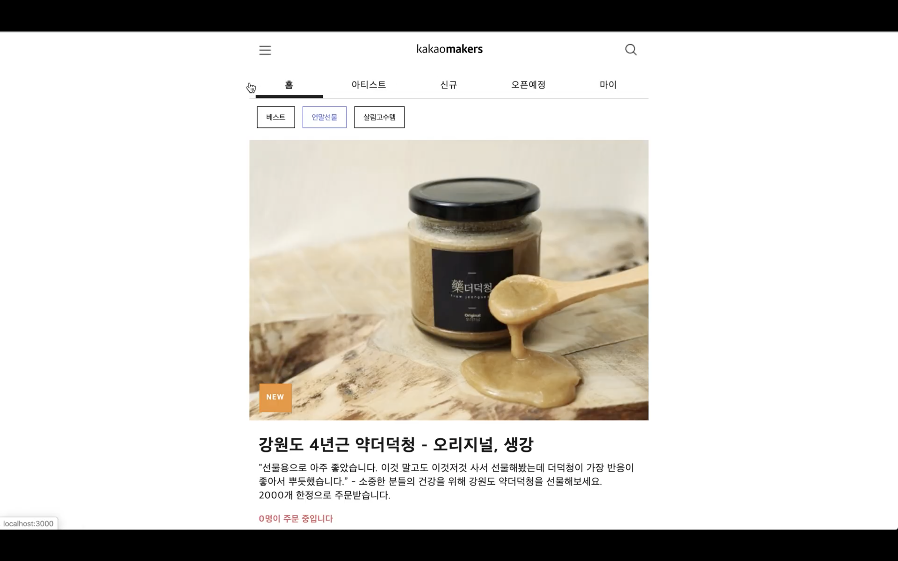

## Introduction
[카카오메이커스](https://makers.kakao.com/) 클론

## Skills
- Python, Django Framework, MySQL, Workbench
- Bcrypt, JWT
- AWS EC2, RDS
- Selenium, BeautifulSoup4

## Features
- 회원가입 API : Bcrypt를 통해 사용자 패스워드 암호화
- 인증/인가 API : JWT를 통해 인증, 인가
- 상품 GET API 
- Review 작성 구현
- Question 작성, 삭제 구현
- 좋아요 기능 구현

## Demo

- [frontend](https://github.com/wecode-bootcamp-korea/weMakers_frontend) git

## Contact
Nam-Eunji, namji117@gmail.com

